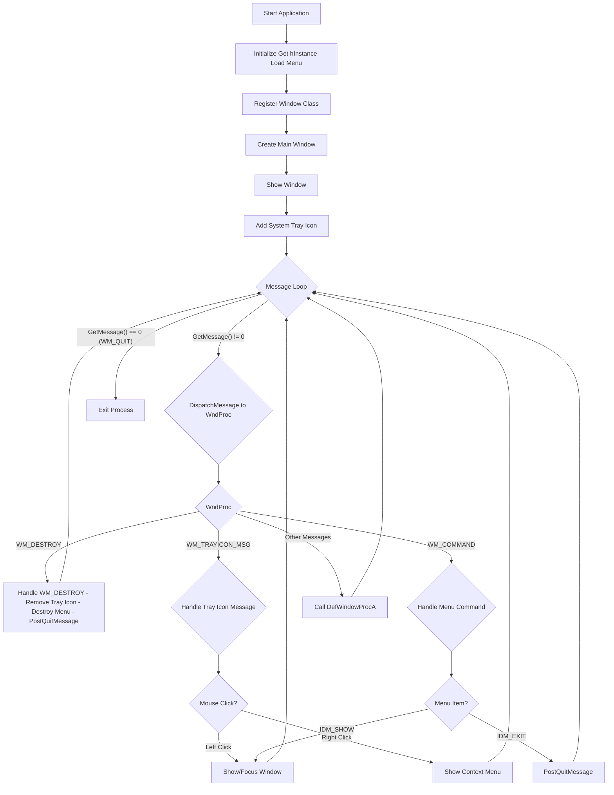

```mermaid
graph TD;
    Start["Start Application"] --> Init["Initialize Get hInstance Load Menu"];
    Init --> RegisterClass["Register Window Class"];
    RegisterClass --> CreateWindow["Create Main Window"];
    CreateWindow --> ShowWindow["Show Window"];
    ShowWindow --> AddTrayIcon["Add System Tray Icon"];
    AddTrayIcon --> MessageLoop{"Message Loop"};
    
    MessageLoop -- "GetMessage() != 0" --> Dispatch{"DispatchMessage to WndProc"};
    MessageLoop -- "GetMessage() == 0 (WM_QUIT)" --> Exit["Exit Process"];

    Dispatch --> WndProc{"WndProc"};
    WndProc -- "WM_DESTROY" --> HandleDestroy["Handle WM_DESTROY - Remove Tray Icon - Destroy Menu - PostQuitMessage"];
    HandleDestroy --> MessageLoop;

    WndProc -- "WM_TRAYICON_MSG" --> HandleTrayMsg{"Handle Tray Icon Message"};
    HandleTrayMsg --> CheckTrayClick{"Mouse Click?"};
    CheckTrayClick -- "Left Click" --> ShowHideWindow["Show/Focus Window"];
    CheckTrayClick -- "Right Click" --> ShowContextMenu["Show Context Menu"];
    ShowHideWindow --> MessageLoop;
    ShowContextMenu --> MessageLoop;

    WndProc -- "WM_COMMAND" --> HandleCommand{"Handle Menu Command"};
    HandleCommand --> CheckMenuItem{"Menu Item?"};
    CheckMenuItem -- "IDM_SHOW" --> ShowHideWindow;
    CheckMenuItem -- "IDM_EXIT" --> PostQuit["PostQuitMessage"];
    PostQuit --> MessageLoop;

    WndProc -- "Other Messages" --> DefaultProc["Call DefWindowProcA"];
    DefaultProc --> MessageLoop;
```