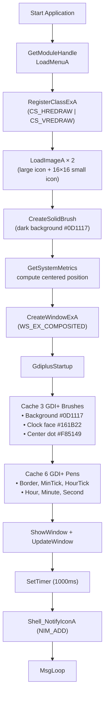
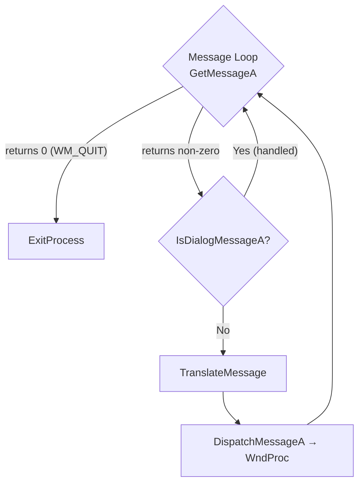
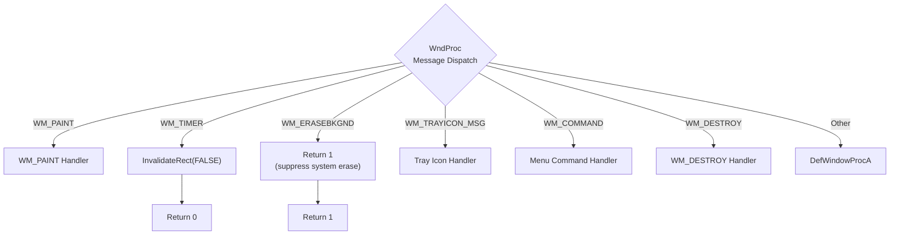
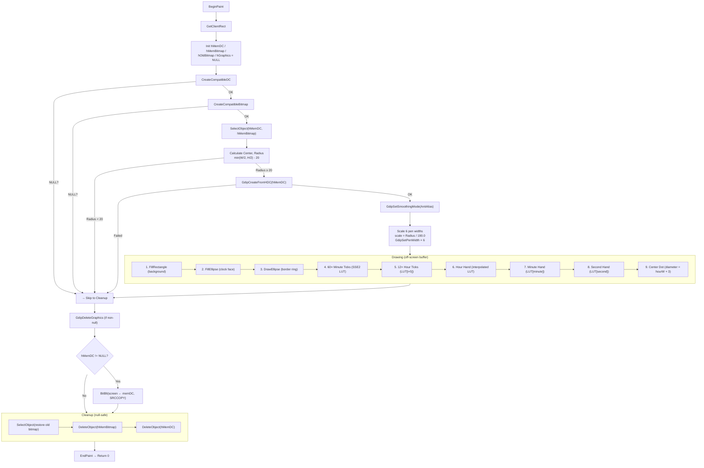
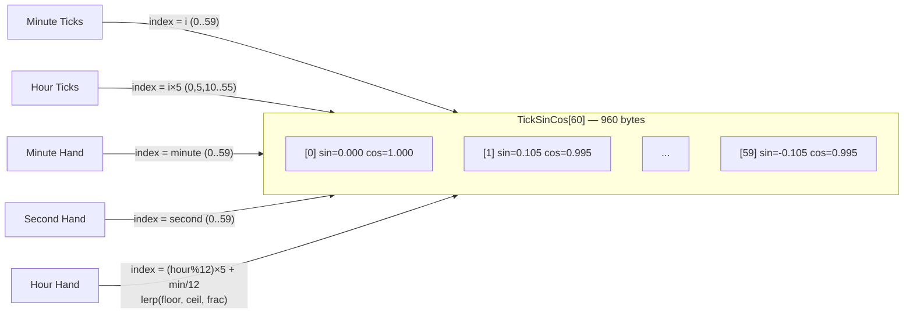
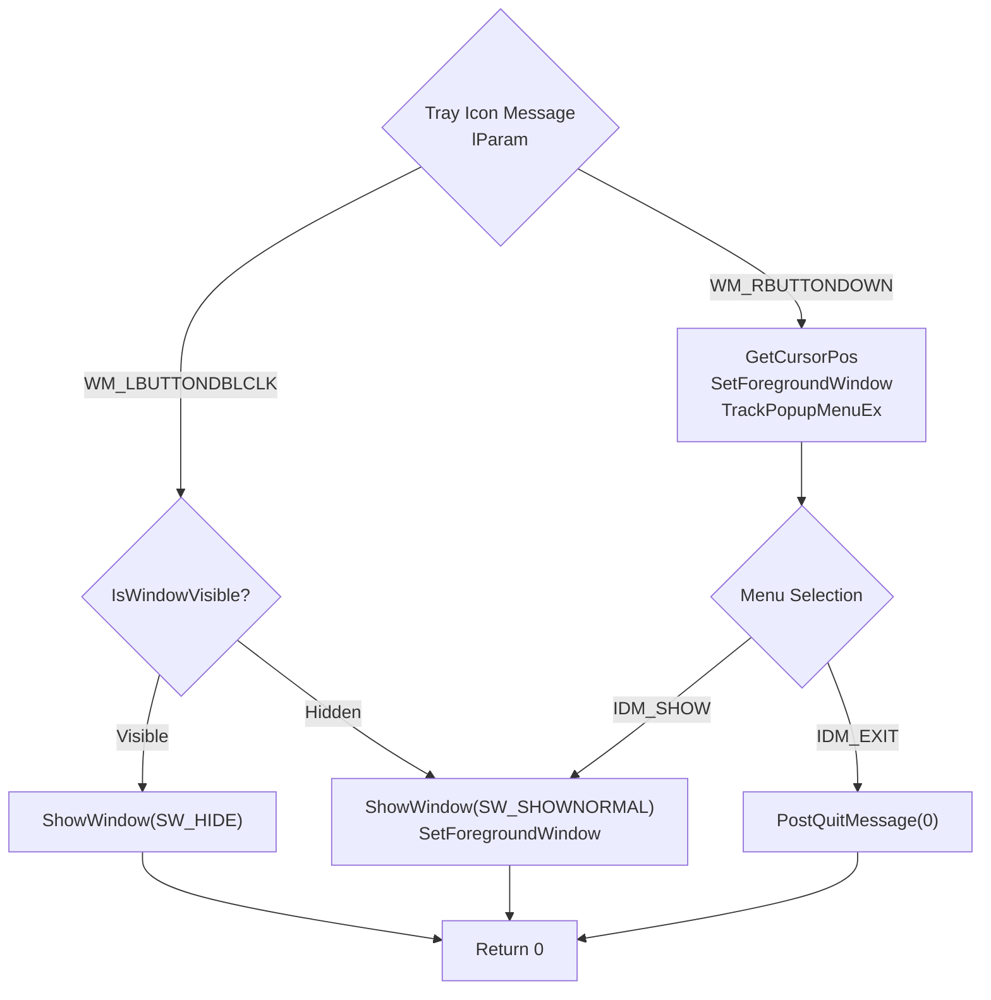
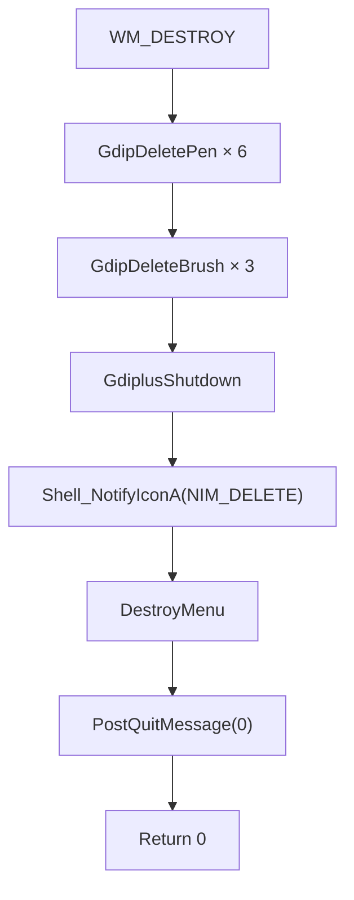

# ASM Clock — Application Flow

## Startup & Initialization

## Message Loop & Dispatch

## WndProc Message Handling

## WM_PAINT — Rendering Pipeline

## SSE2 Lookup Table Architecture

## Tray Icon Interactions

## WM_DESTROY — Shutdown Sequence

